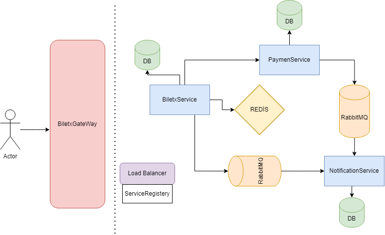
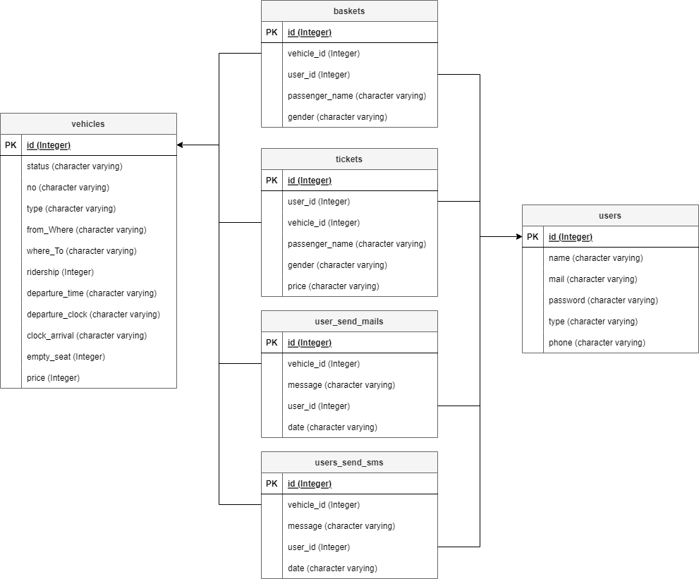

# Kodluyoruz-Java-Bootcamp-Final-Homework
Otobüs ve uçak seyahatleri için bilet satışı yapan bir firmanın isterlerini gerçekleştiren bir backend projesidir. 

## Projenin içeriği:
Sistemde 3 tip kullanıcı çeşidi vardır; admin, individual (bireysel), corporate (kurumsal)

### Admin 
Yalnızca admin kullanıcıların yapabileciği işlemler.

* Seyahat ekleme işlemi yapabilir.
* Seyahati iptal edebilir.
* Seyahate ait toplam bilet satışı ve toplam ücreti görüntüleyebilir.
* Tüm seyahatleri görüntüleyebilir.
* Tüm kullanıcıları görüntüleyebilir.

### Individual (Bireysel)
Yalnızca individual kullanıcıların yapabileciği işlemler.

* Her bir seyahat için en fazla 5 bilet satın alabilir.
* Tek siparişte en fazla 2 erkek yolcu için bilet alabilir.

### Corporate (Kurumsal)
Yalnızca corporate kullanıcıların yapabileciği işlemler.

* Her bir seyahat için en fazla 20 bilet satın alabilir.

### Tüm kullanıcılar için ortak işlemler

* Kullanıcı kayıt yapabilir. (Kulanıcıların şifre güvenliği SHA-512 ile güvence altına alınmışır.Kayıt işlemi 
  tamamlandıktan 
  sonra 
  **asenkron** olarak kullanıcıya mail 
  gönderilir.)
* Sepetine ürün ekleyebilir.
* Sepetindeki ürünleri görüntüleyebilir.
* Ödeme işlemi yapabilir. (Ödeme işlemi başarılı ise **asenkron** olarak kullanıcıya sms gönderilir.)
* Şehir biligisine göre sefer arayabilir. (Büyük küçük harf duyarlılığı yoktur. Eksik yazıldığında da arama yapabilir.)
* Seyehat edeceği taşıt türüne göre arama yapabilir.

### Sistem kabulleri

* Uçak yolcu kapasitesi :189
* Otobüs yolcu kapasitesi: 45
* Ödeme şekli sadece kredi kartı ve Havale/EFT olabilir.
* Ödeme servisi işlemleri **senkron**dur.

## Diagramlar

## Kullanılan Teknolojiler
* JAVA 17
* JUnit
* RESTful
* Spring Boot
* PostgreSQL
* RabbitMQ
* Postman

	&nbsp;&nbsp;<a href="https://www.postgresql.org" target="_blank" rel="noreferrer"> &nbsp;&nbsp;  &nbsp;&nbsp; &nbsp;&nbsp; </a>

